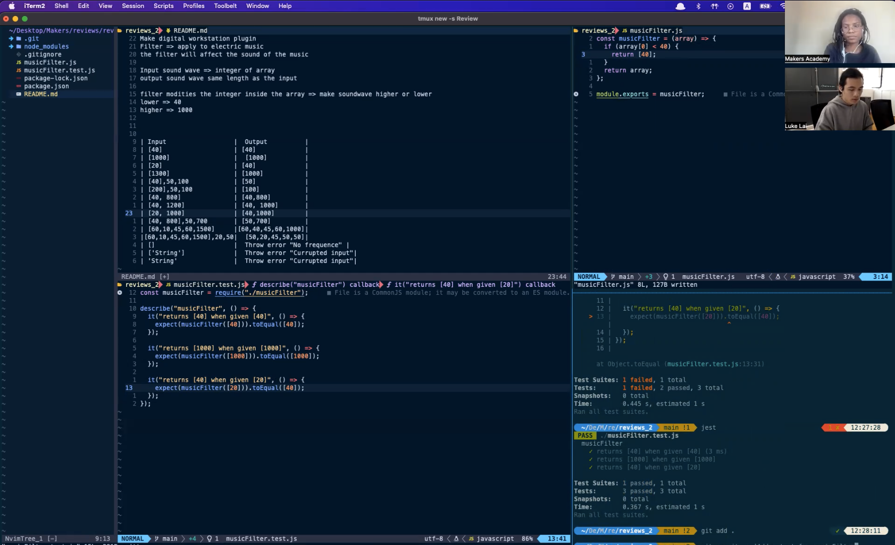

# Code review : Band Pass Filter

I conducted this coding challenge under the assessment of an independent professional reviewer from [CoGrammar](https://www.cogrammar.com/). The reviewer's feedback of my code can be found [here](assets/Band_Pass_Filter_feedback.pdf), and the live recording here:

## Task

A client wants you to implement an app that takes an array of sound wave frequencies, and returns an array with any frequencies below a specified minimum limit increased to meet the minimum, and any frequencies above a specified maximum limit decreased to meet the maximum. See the input/output table below for examples.

## Tech

| Programming language | Testing tool |
| -------------------- | ------------ |
| JavaScript           | Jest         |

## Input -> Output table

| Input                    | Output                        |
| ------------------------ | ----------------------------- |
| [40]                     | [40]                          |
| [1000]                   | [1000]                        |
| [20]                     | [40]                          |
| [1300]                   | [1000]                        |
| [40],50,100              | [50]                          |
| [200],50,100             | [100]                         |
| [40, 800]                | [40,800]                      |
| [40, 1200]               | [40, 1000]                    |
| [20, 1000]               | [40,1000]                     |
| [40, 800],50,700         | [50,700]                      |
| [60,10,45,60,1500]       | [60,40,45,60,1000]            |
| [60,10,45,60,1500],20,50 | [50,20,45,50,50]              |
| []                       | Throw error "No frequence"    |
| ['String']               | Throw error "Currupted input" |
| 'String'                 | Throw error "Currupted input" |
